## Content

-   Introducing maps
-   Typology of maps
    -   Reference maps
    -   Thematic maps
-   Proportional Symbol Map
-   Choropleth Mapping
-   Introduction to tmap Methods

::: notes
This lesson consists of two parts. First, I will share with you the concepts and design principles of choropleth maps. Next, I will introduce you to tmap, an R package specially designed for thematic mapping based on Layered Grammar of Graphics
:::

## What is a Map?

A model of real world depict by a collection of cartographic symbols or/and visual abstraction.

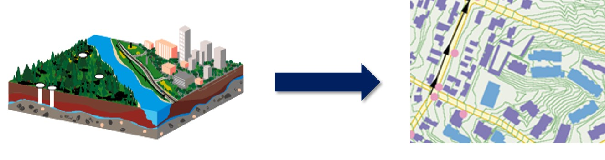

------------------------------------------------------------------------

### What is a Map?

An interface between geographical data and map users.

------------------------------------------------------------------------

### A Map and Geographical Data

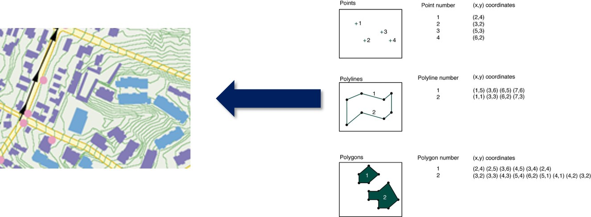

------------------------------------------------------------------------

### Types of geographical data

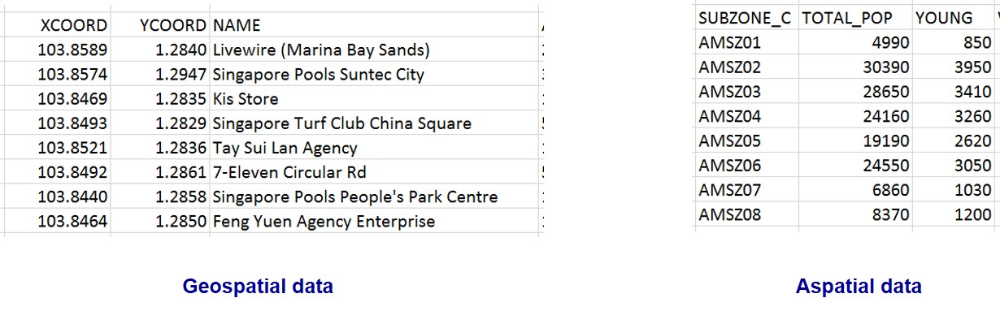

## Typology of Maps

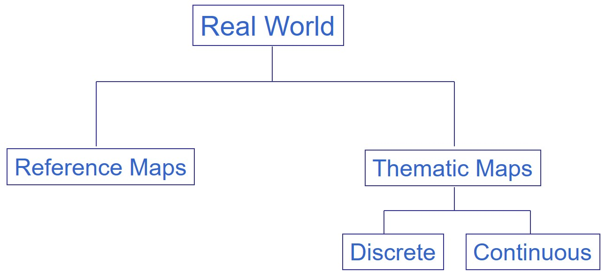

------------------------------------------------------------------------

### Reference maps

::::: columns
::: {.column width="30%"}
-   Reference maps emphasize the location of spatial phenomena, such buildings, roads, vegetations, rivers, etc. Some of popular reference maps are **topographical map** and internet map such as Google map.
:::

::: {.column width="65%"}
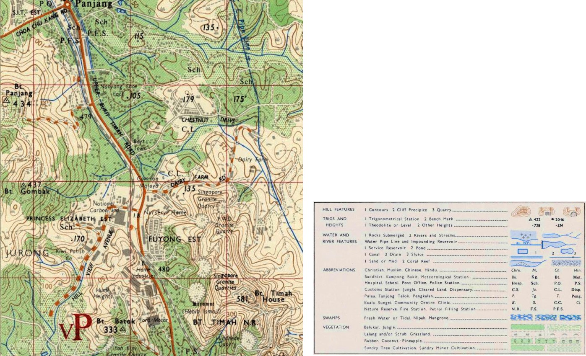
:::
:::::

::: notes
Topographic maps are detailed, accurate graphic representations of features that appear on the Earth's surface. These features include: cultural: roads, buildings, urban development, railways, airports, names of places and geographic features, administrative boundaries, state and international borders, reserves hydrography: lakes, rivers, streams, swamps, coastal flats relief: mountains, valleys, slopes, depressions vegetation: wooded and cleared areas, vineyards and orchards.

A map legend (or key) lists the features shown on that map, and their corresponding symbols. Topographic maps usually show a geographic graticule and a coordinate grid, so you can determine relative and absolute positions of mapped features.\
It is important to note that a map is merely a two or three dimensional representation of the physical environment at a given time. Therefore, a map will never be entirely up to date. Changes to the landscape and cultural features regularly occur (such as roads, vegetation, and buildings), resulting in maps becoming dated, although the rate of obsolescence varies depending upon location. Traditionally present in paper printed format.
:::

------------------------------------------------------------------------

### Thematic Map

:::::: columns
:::: {.column width="50%"}
-   Thematic maps emphasize the spatial pattern of geographic attributes or statistics about places and relationships between places such as Life in Los Angeles.

::: {style="font-size: 0.65em"}
Source: [Life in Los Angeles](https://mapdesign.icaci.org/2014/12/mapcarte-353365-life-in-los-angeles-by-eugene-turner-1977/)
:::
::::

::: {.column width="50%"}
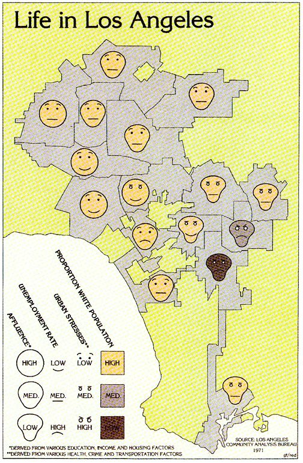
:::
::::::

## Thematic Mapping: Principles and Methods

-   Displaying
    -   Qualitative data
    -   Quantitative data
-   Choosing -Appropriate classification method for displaying data
    -   Appropriate number of classes
-   Techniques in data analysis
    -   Using the classification histogram
    -   Normalizing data

## Qualitative Thematic Maps

### Visual Variables and Cartographic Symbols

::::: columns
::: {.column width="50%"}
-   Qualitative visual variables are used for nominal scale data.
-   The goal of qualitative visual variables is to show how entities differ from each other.
-   The visual variables that do a good job of showing ordinal differences are: colour value, colour saturation, size and texture/grain.\
-   Figure on the right for examples of these four ordinal visual variables used each in point, linear and areal symbols.
:::

::: {.column width="50%"}
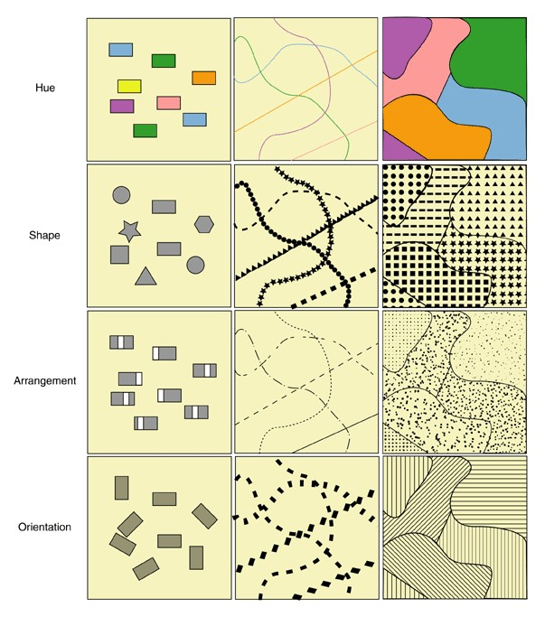
:::
:::::

## Qualitative Thematic Map

### Point symbol map

::::: columns
::: {.column width="40%"}
-   Different point symbols are used to represent school types.
:::

::: {.column width="60%"}
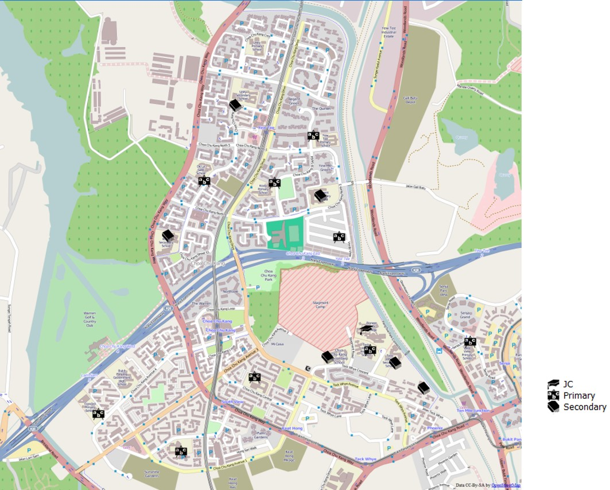
:::
:::::

## Qualitative Thematic Map

### Line symbol map

::::: columns
::: {.column width="40%"}
-   A road map is an example of a thematic map. It shows the road network of an area. In this map, lines with different colour intensity and tickness are used to differentiate hierarchy of roads.
:::

::: {.column width="60%"}
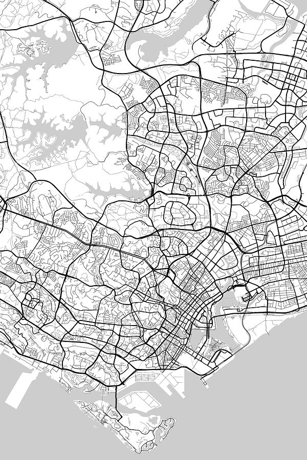{width="467"}
:::
:::::

## Qualitative Thematic Map

### Area map

::::: columns
::: {.column width="40%"}
-   Land use map below is a good example of a discrete thematic map. In this map, different colours are use to represent different land use types.
:::

::: {.column width="60%"}
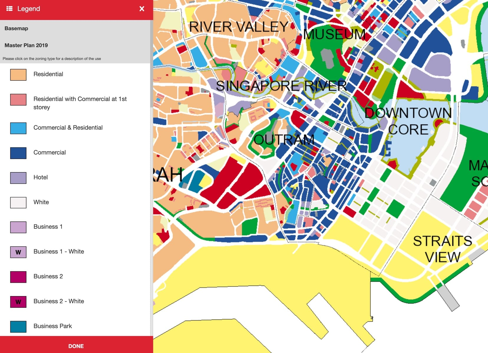
:::
:::::

## Quantitative Thematic Map

### Visual Variables and Cartographic Symbols

::::: columns
::: {.column width="50%"}
-   Quantitative visual variables are used to display ordinal, interval or ratio scale data.\
-   The goal of the quantitative visual variable is to show relative magnitude or order between entities.
-   The visual variables that do a good job of showing ordinal differences are: colour value, colour saturation, size and texture/grain.\
-   Figure on the right shows of these four ordinal visual variables used each in point, linear and areal symbols.
:::

::: {.column width="50%"}
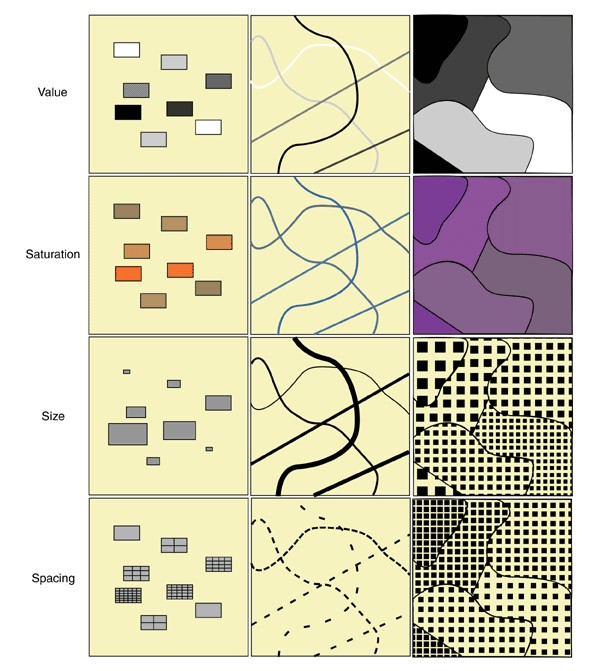
:::
:::::

## Proportional Symbol Map

-   The proportional symbol technique uses symbols of different sizes to represent data associated with different areas or locations within the map.

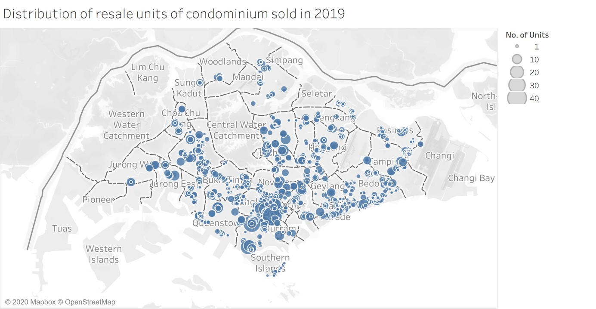

::: notes
The proportional symbol technique uses symbols of different sizes to represent data associated with different areas or locations within the map. For example, the proportional maps above use circle with different sizes to represent millions of people. There are two types of point features that are typically depicted with proportional symbols: features for which the data represents a geographic position directly (e.g., gallons of oil from individual oil wells), and features that are geographic areas to which data are aggregated and the data magnitudes are assigned to a representative point within the area (e.g., the geographic centroid of a state as in the examples above). In either case, the area of the symbol is scaled to represent the data magnitude, sometimes with a bit of exaggeration to adjust for a general tendency of human vision to underestimate differences in area. A variant on this direct data-to-symbol scaling groups values into categories first, then scales the symbol to represent the mean for the category, assigning a symbol to each place to represent the category range that the mean for the place falls within
:::

------------------------------------------------------------------------

### How to size circles incorrectly and correctly?

Figure below explains how attribute values are map on circles. One strategy to overcome this problem is to use square instead of circle.

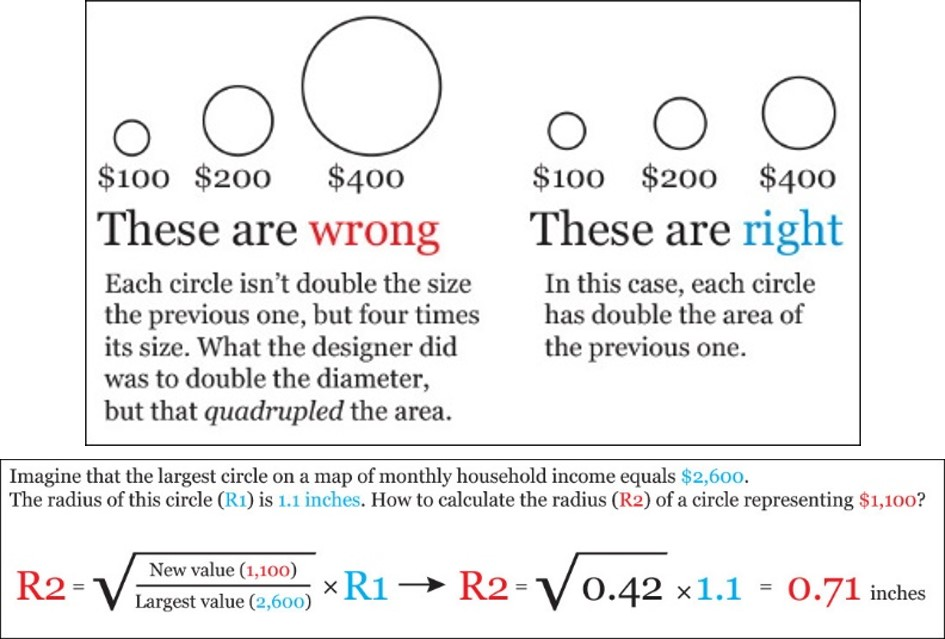

------------------------------------------------------------------------

### How to make proportional symbol maps clearer?

When designing a proportional symbol map, one of the important consideration is to avoid the circles blocking each other. One possible strategy to overcome this problem is to applying opacity (also known as transparency).

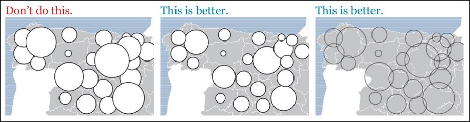

------------------------------------------------------------------------

### Proportional Symbol Map: Pie Chart Map

One important characteristic of proportional symbols is that they can easily be designed to represent more than one data value per location. Among the most common example is a **pie chart map** in which a circle is scaled proportionally to some total, and the size of wedges within the circle is scaled to depict a proportion of a total for two or more sub-categories.

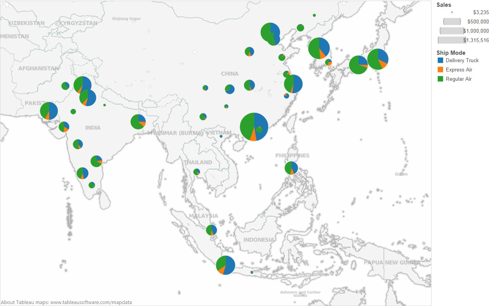

::: notes
One important characteristic of proportional symbols is that they can easily be designed to represent more than one data value per location. Among the most common example is a "pie chart map" in which a circle is scaled proportionally to some total, and the size of wedges within the circle is scaled to depict a proportion of a total for two or more sub-categories. The map above uses circle size to depict total sales in each city, and the pie slices then depict proportion of the three shipping modes, namely: delivery truck, express air and regular air.
:::

------------------------------------------------------------------------

### Proportional Symbol Map: Bar Chart Map

**Proportional side-by-side bar map** places side-by-side bar chart on a map based on the location of the observations.

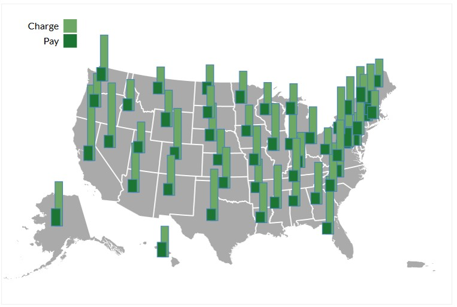

------------------------------------------------------------------------

### Proportional Symbol Map - Junk Map

When preparing a proportional symbol map, it is important to ensure that the geographical level used is the same.

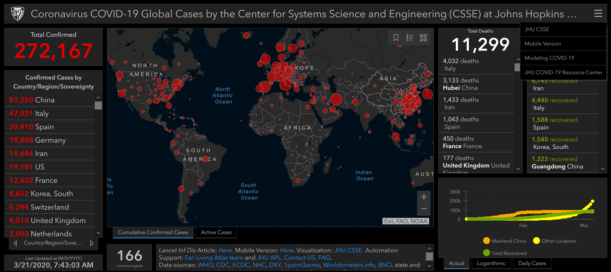

::: {style="font-size: 0.65em"}
Source: [COVID-19 Dashboard](https://gisanddata.maps.arcgis.com/apps/opsdashboard/index.html#/bda7594740fd40299423467b48e9ecf6)
:::

------------------------------------------------------------------------

### Altertive of Proportional Symbol Map: Bricks Map

Bricks Map aims to provide better ways to encode quantitative information graphically---ways that can be easily, efficiently, and accurately decoded.

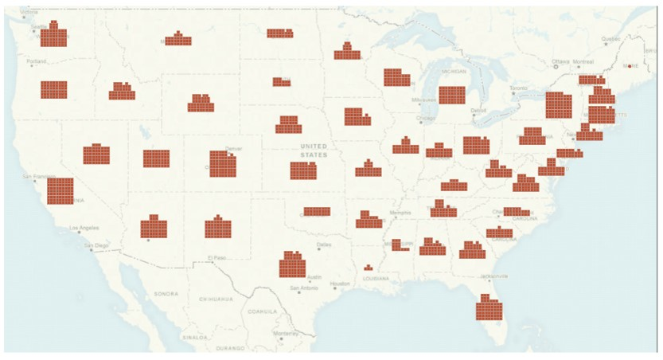

::: {style="font-size: 0.65em"}
Source: [Building insight with bricks](http://www.perceptualedge.com/articles/visual_business_intelligence/building_insight_with_bricks.pdf).
:::

------------------------------------------------------------------------

### Bricks Map versus Proportional Symbol Map

By plotting a proportional symbol map and a bricks map side-by-side as shown below, it is clear that bubbles of graduated sizes proportional to the value ranges that they represent can be difficult to distinguish than the bricks.

::::: columns
::: {.column width="50%"}
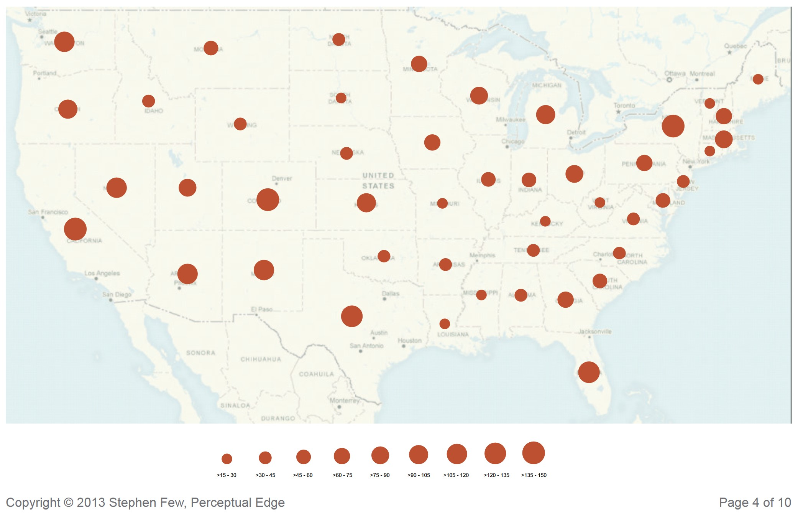
:::

::: {.column width="50%"}

:::
:::::

## Dot Density Map

A dot-density map is a type of thematic map that uses dots or other symbols on the map to show the values of one or more numeric data fields. Each dot on a dot-density map represents some amount of data.

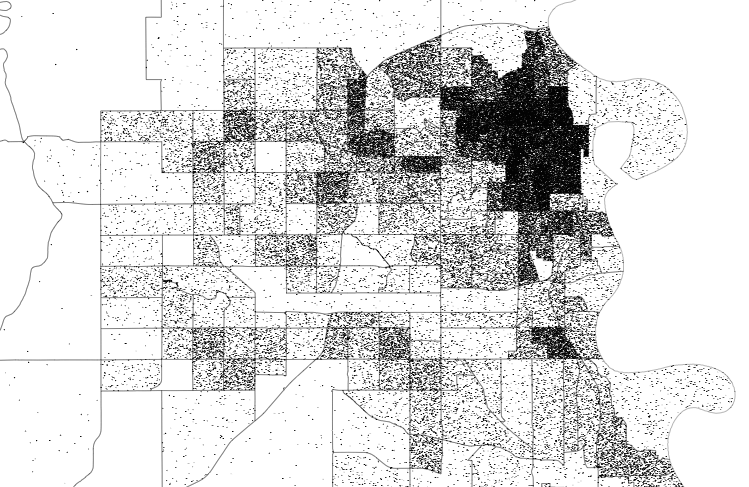

::: {style="font-size: 0.5em"}
One dot represent 100 households.
:::

::: {style="font-size: 0.65em"}
Reference: [Dot distribution map](https://en.wikipedia.org/wiki/Dot_distribution_map) at wiki and [Dot Density Maps](https://www.axismaps.com/guide/dot-density)
:::

## Choropleth Map

A choropleth map is a type of thematic map in which areas are shaded or patterned in proportion to a statistical variable that represents an aggregate summary of a geographic characteristic within each area, such as population or per-capita income.

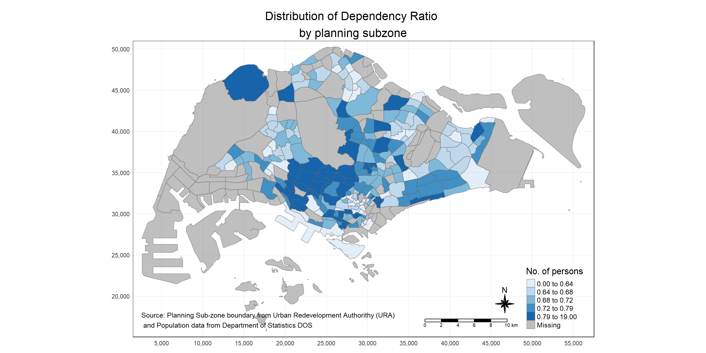

------------------------------------------------------------------------

### Classified choropleth map

-   Choropleth maps can be either classified or unclassified.
-   A classed choropleth map combines areal units into a smaller number of groups. Interval levels may vary, but typically 4 to 7 are used in a map. There is different classification techniques used to divide up the intervals.

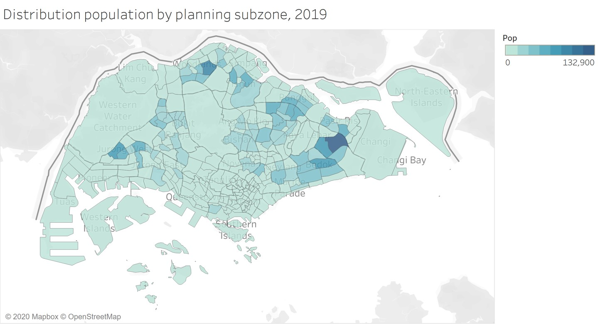

------------------------------------------------------------------------

### Unclassified choropleth map

-   Unclassed choropleth maps are similar to classed choropleth maps; however, unclassed choropleth maps do not have an averaged statistic towards each particular colour.

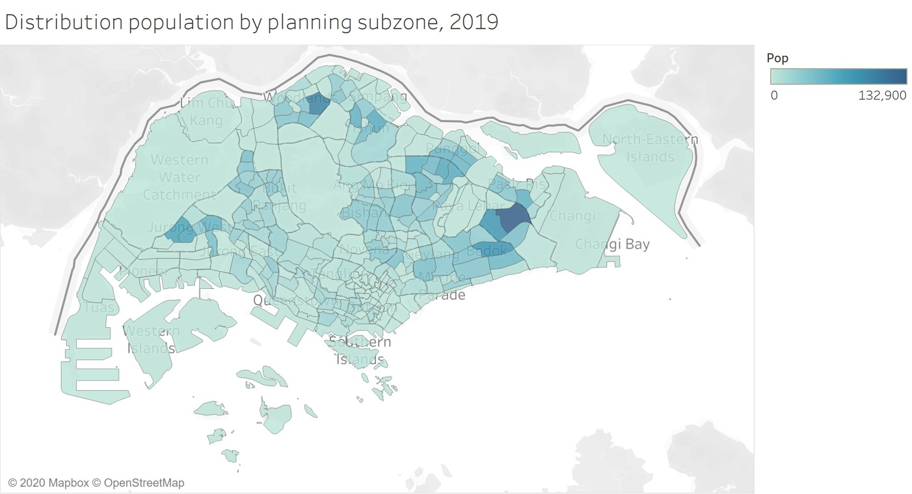

------------------------------------------------------------------------

### Choosing an appropriate number of classes

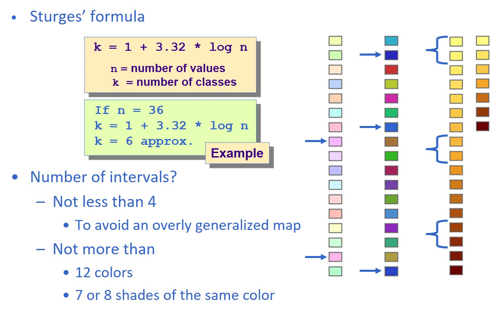

::: notes
The more classes you use, the less data generalization (which is good), but this comes at the expense of legibility and the associated risk of map reading errors since more colors are harder to see and print reliably (which is bad). The key question is how much generalization do you want? A map with 3 classes/colors (e.g., low, medium, high) will be easy to see and remember, but may gloss over some very important aspects of the data and create artificial geographic patterns by lumping together many places that are in fact quite different. There is no ideal number of classes for a map, so experiment.
:::

## Data classification

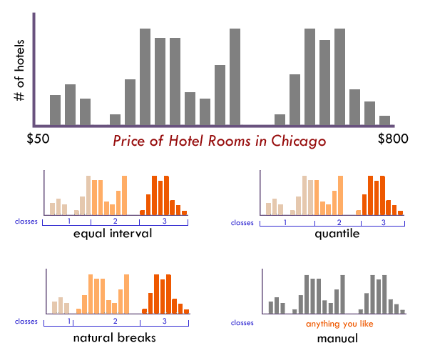

::: notes
Not sure how many classes to use? Have a look at the distribution of your data in a histogram (see examples below): Are there obvious clusters within your data? Are there large gaps in your data range that suggest nice compact data classes? If so, pick that number of classes and place those class breaks around those clusters.
:::

------------------------------------------------------------------------

### Methods of choosing classes

-   Based on the nature of the distribution
    -   quantile, equal interval, natural breaks, standard deviations, defined interval
-   Arbitrary
    -   Can be based on round numbers.
    -   Examples: Grouping according to age or census housing categories
    -   Can result in empty categories

------------------------------------------------------------------------

### Data classification method: Quantile

-   Same number of features per class.

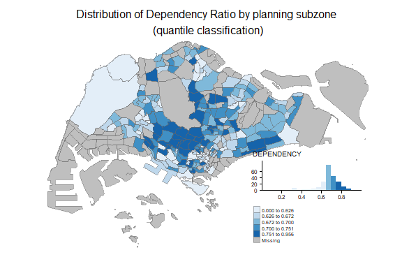{fig-align="center"}

------------------------------------------------------------------------

### Data classification method: Equal interval

:::::: columns
::: {.column width="70%"}
-   Divides the range of attribute values into equally sized classes.

{width="900"}
:::

:::: {.column width="30%"}
::: callout-caution
### Caution

Avoid equal interval if your data are skewed to one end or if you have one or two really large outlier values. Outliers in that case will likely produce empty classes, wasting perfectly good classes with no observations in them. Since the hotel data above doesn't have really large outliers, this is a data distribution that works well with equal interval.
:::
::::
::::::

------------------------------------------------------------------------

### Data classification method: Jenks (also known as Natural breaks)

-   Default Jenk's statistical optimization
-   Finds natural groupings in the data

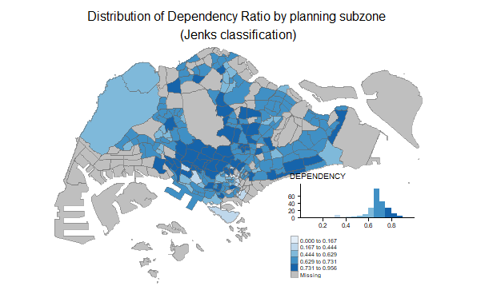

------------------------------------------------------------------------

### Data classification: Standard deviation

-   A measure of dispersion.
-   Use if the distribution approximates a normal distribution (bell-shaped curve)

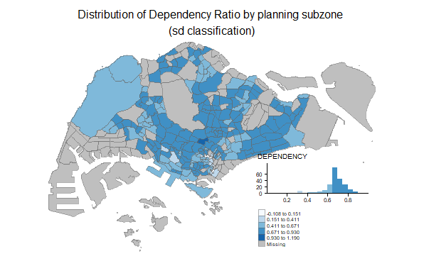

## Colour scheme

[ColorBrewer](http://colorbrewer2.org/)

::::: columns
::: {.column width="50%"}
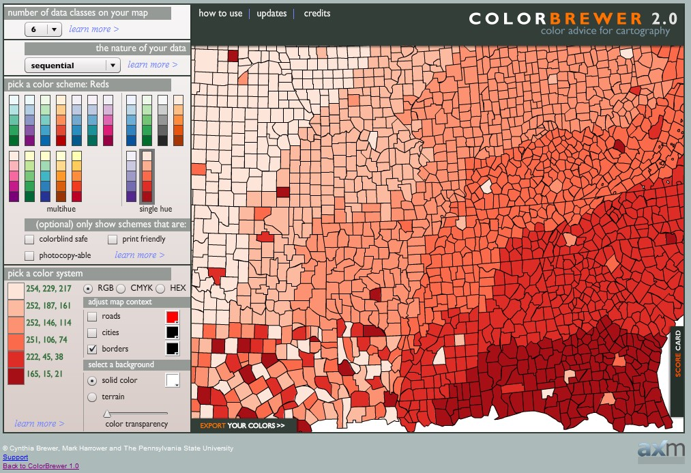
:::

::: {.column widht="50%"}
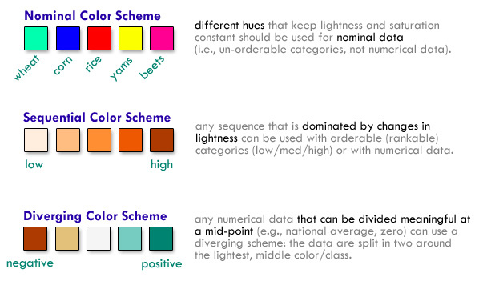
:::
:::::

## Mapping packages in R

::::: columns
::: {.column width="50%"}
### Selected popular mapping packages

[CRAN Task View: Analysis of Spatial Data](https://cran.r-project.org/web/views/Spatial.html)

-   [tmap](https://cran.r-project.org/web/packages/tmap/index.html)
-   [mapsf](https://riatelab.github.io/mapsf/index.html)
-   [leaflet](https://cran.r-project.org/web/packages/leaflet/index.html)
-   [ggplot2](https://ggplot2.tidyverse.org/index.html). Read [Chapter 6: Maps](https://ggplot2-book.org/maps.html) of 'ggplot2: Elegant Graphics for Data Analysis' for more detail.
-   [ggmap](https://cran.r-project.org/web/packages/ggmap/index.html)
-   [quickmapr](https://cran.r-project.org/web/packages/quickmapr/index.html)
-   [mapview](https://cran.r-project.org/web/packages/mapview/index.html)
:::

::: {.column width="50%"}
### Other packages

-   [RColorBrewer](https://cran.r-project.org/web/packages/RColorBrewer/index.html)
-   [classInt](https://cran.r-project.org/web/packages/classInt/index.html)
:::
:::::

## Introducing **tmap**

::::: columns
::: {.column width="50%"}
-   [**tmap**](https://r-tmap.github.io/tmap/index.html) is a R package specially designed for creating thematic maps using the pricinples of the **Grammar of Graphics**.
-   It offers a flexible, layer-based, and easy to use approach to create thematic maps, such as choropleths and proportional symbol maps.
-   It supports two modes: `tm_plot()` for static maps and `tm_view()` for interactive maps.
-   It provides shiny integration with  `renderTmap()`, `tmapOutput()`, `tmapProxy()` and `tm_remove_layer()`.
:::

::: {.column width="50%"}
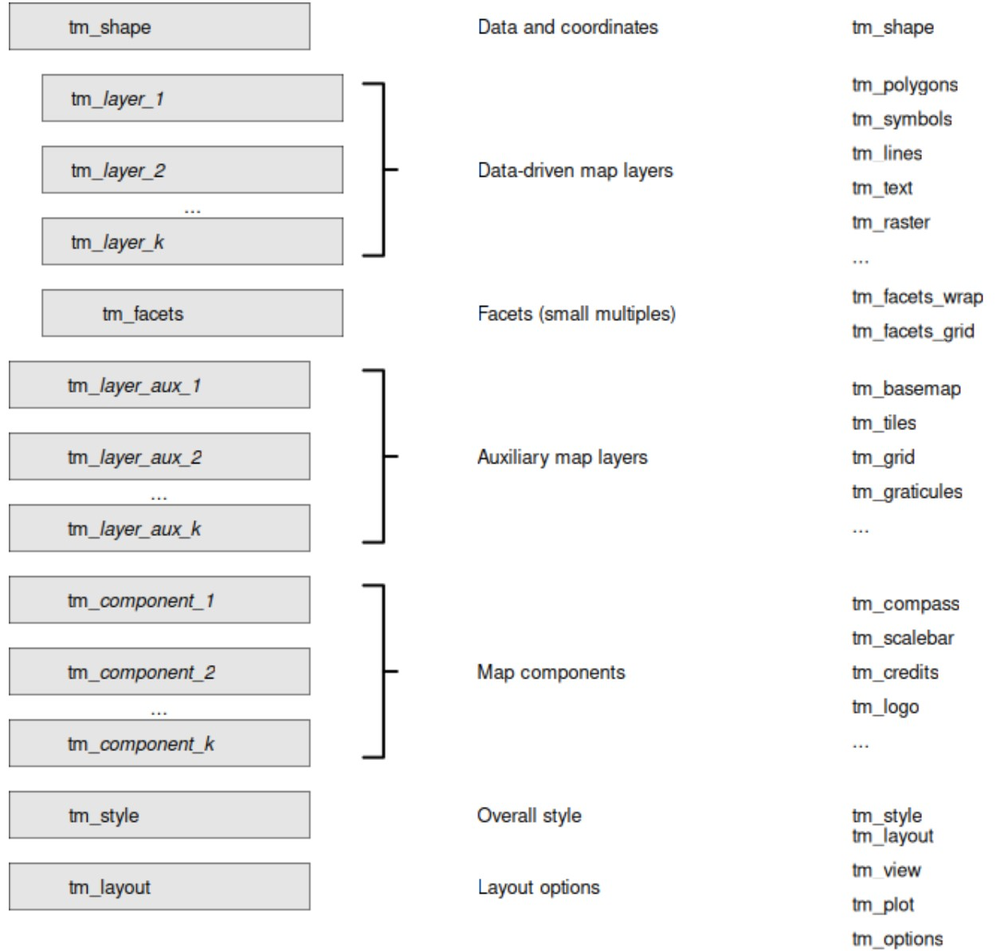
:::
:::::

## Reference

### Principles, Concepts and Methods of Choropleth Maps Design

**Core Reading**

-   [Choropleth Maps](https://www.axismaps.com/guide/univariate/choropleth/)
-   [The Basics of Data Classification](https://www.axismaps.com/guide/data/data-classification/)

**Additional Readings**

-   [Choropleth Maps -- A Guide to Data Classification](https://gisgeography.com/choropleth-maps-data-classification/)
-   [Bivariate Choropleth](https://www.axismaps.com/guide/multivariate/bivariate-choropleth/)
-   [Value-by-alpha maps](http://andywoodruff.com/blog/value-by-alpha-maps/)
-   [What to consider when creating choropleth maps](https://blog.datawrapper.de/choroplethmaps/)
-   [Choropleth Mapping with Exploratory Data Analysis](https://www.directionsmag.com/article/3363)

## References

### All About **tmap** package

-   [tmap: Thematic Maps in R](https://www.jstatsoft.org/article/view/v084i06)

-   [tmap home page](https://r-tmap.github.io/tmap/index.html)

-   [Spatial Data Visualization with tmap: A Practical Guide to Thematic Mapping in R](https://tmap.geocompx.org/)

-   [tmap: creating thematic maps in a flexible way (useR!2015)](https://mtennekes.github.io/downloads/presentations/tmap_user2015.pdf)

-   [Exploring and presenting maps with tmap (useR!2017)](https://mtennekes.github.io/downloads/presentations/tmap_user2017.pdf)

