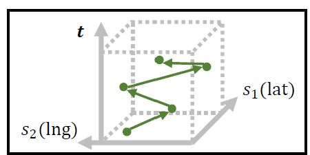
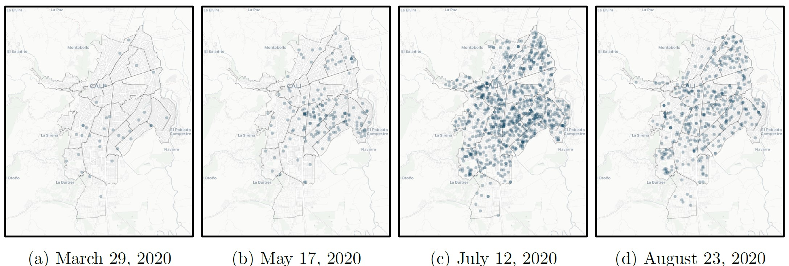
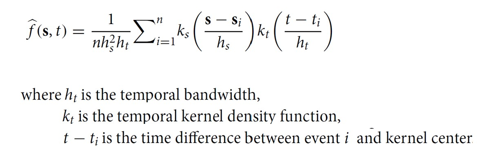

## Content

- Basic concepts of Spatio-Temporal Point Process
- Spatio-Temporal Kernel Density Estimation

## What is a Spatio-Temporal Point Process

A spatio-temporal point process (also called space-time or spatial-temporal point process) is a random collection of points, where each point represents the time and location of an event. Examples of events include incidence of disease, sightings or births of a species, or the occurrences of fires, earthquakes, lightning strikes, tsunamis, or volcanic eruptions. Typically the spatio-temporal point events are recorded in three-dimension, namely: longitude, latitude, and time as shown in the figure below.

------------------------------------------------------------------------

### Real world spatio-temporal point events

Snapshots of confirmed COVID-19 cases at four particular weeks in Cali, Columbia. Each dot represents the location of a confirmed case. Note that darker dots indicate multiple dots being overlapped

## Spatio-Temporal KDE (STKDE)

Mathematically, STKDE is defined as

