## Content

- Network Constrained Kernel Density Estimation (NCKDE)
  - Basic concepts of network constrained spatial point patterns
  - Network Constrained KDE methods
  - The Three versions of Network Constrained KDE
- Temporal Network Kernel Density Estimation (TNKED)
  - Temporal dimension
  - Spatial dimension
  - Spatio-temporal point patterns

::: notes
Welcome to Lesson 3: Spatial Point Pattern Analysis, a family of spatial statistics specially developed to model and to test distribution of spatial point events.

The lesson proceeding is divided into three main section. First, I will share with you what are real world spatial point events. This is followed by explaining the concepts and methods of 1st-order and 2nd-order spatial point patterns analysis.
:::

## Network Constrained Point Processes

Many real world point event are not randomly distributed. Their distribution, on the other hand, are constrained by network such as roads, rivers, and fault lines just to name a few of them.

::::: columns
::: {.column width="50%"}
Road traffic accidents within Bangkok City. 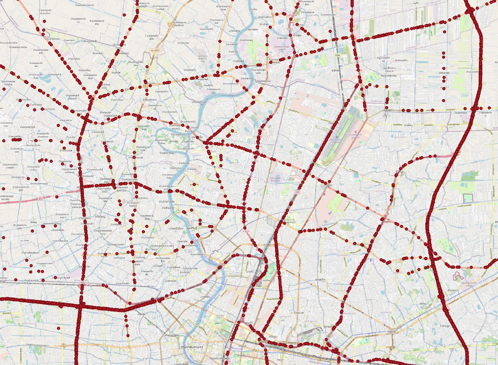
:::

::: {.column width="50%"}
Location of banks at Central, Hong Kong 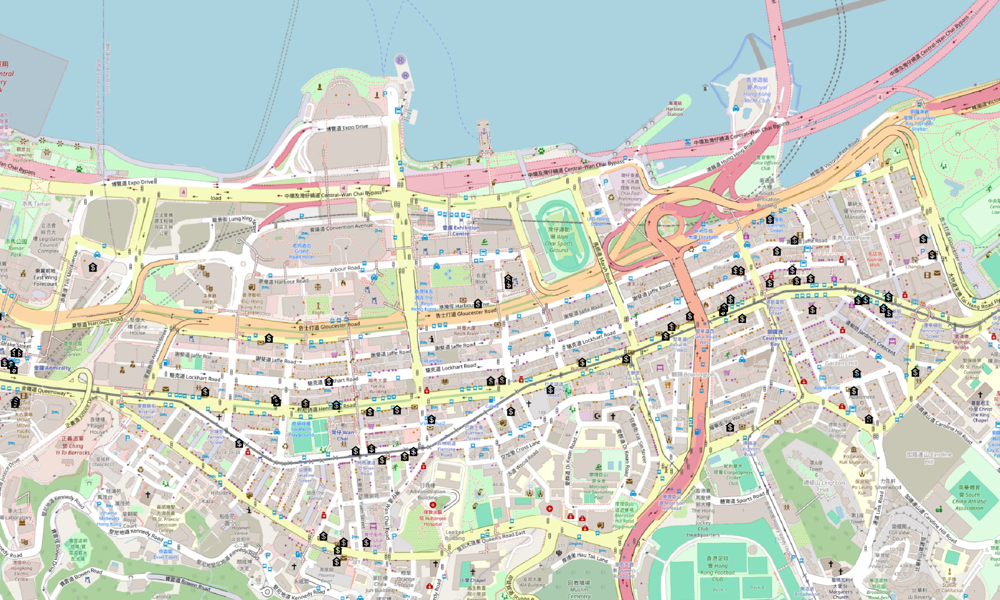
:::
:::::

## Network Constrained Kernel Density Estimation (NKDE)

Network Kernel Density Estimation, in short, NKDE is a geospatial analytics methods specially designed to computer intensity of spatial point event either located along or occurred along linear networks.

:::: columns
::: {.column width="50%"}
Mathematically, NKDE can be defined as: 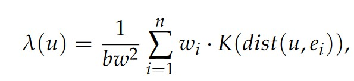

where K must be a probability density function and verifies the two following conditions:

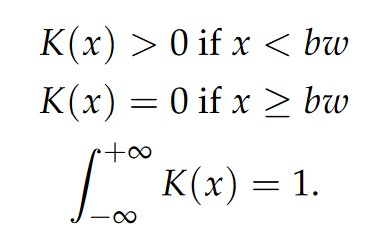
:::
::::

## Network Constrained Kernel Density Estimation (NKDE)

### Planar KDE versus NKDE

::::: columns
::: {.column width="50%"}
Figure on the right shows the basic differences between the Planar KDE and Network KDE for the same spatial point event data. To estimate th density values at a focal point X, the planar KDE treats the whole 2-D space as the context and finds four point events (black circle) within a search bandwidth (i.e. h), whereas the Network KDE only finds two point events within the same bandwidth in the network space based on network distance.
:::

::: {.column width="50%"}
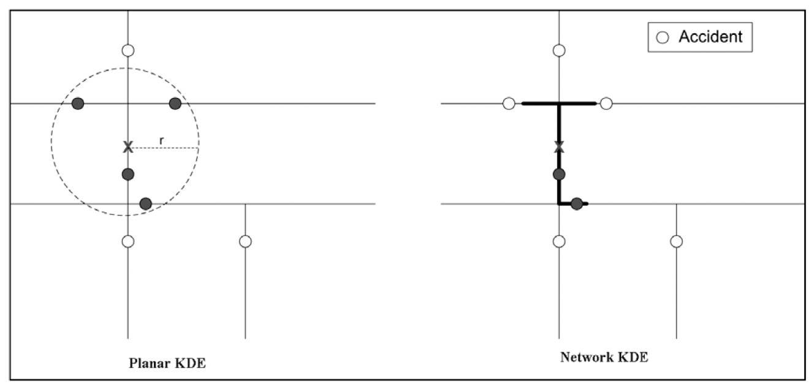
:::
:::::

------------------------------------------------------------------------

### Network Constrained Kernel Density Estimation (NKDE) method

To calculate a Network Kernel Density Estimate (NKDE), it is possible to:

- use lixels instead of pixels. A lixel is a linear equivalent of a pixel on a network. The lines of the network are split into lixels according to a chosen resolution. The centres of the lixels are sampling points for which the density will be estimated.

- calculate network distances between objects instead of Euclidean distances.

- adjust the kernel function to deal with the anisotropic space

------------------------------------------------------------------------

### NKDE Method

- To perform a NKDE, the events must be snapped on the network. The snapped events are shown here in green.

::::: columns
::: {.column width="50%"}
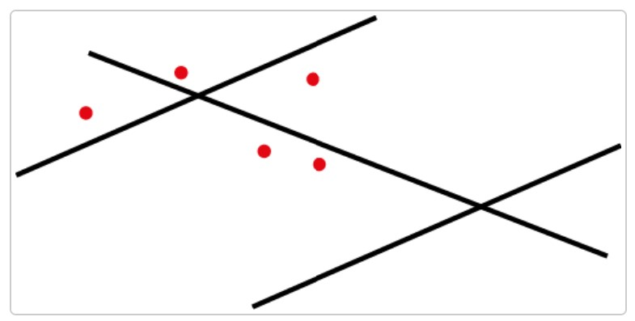
:::

::: {.column width="50%"}
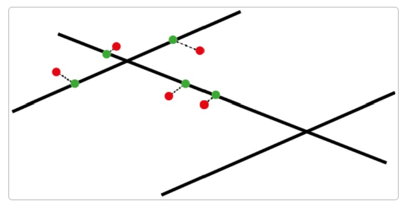
:::
:::::

------------------------------------------------------------------------

### NKDE Method

::::: columns
::: {.column width="50%"}
The mass of each event can be seen as a third dimension and is evaluated by a selected kernel function (K) within a specified bandwidth. The kernel function must satisfy the following conditions:

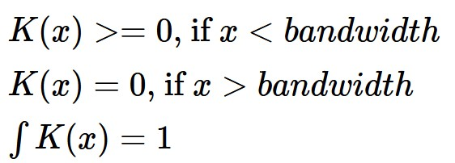{width="480" height="185"}

The total mass of an event is 1, and is spread according to the function *K* within the bandwidth.
:::

::: {.column width="50%"}
In the figure below, we can see that the “influence” of each point is limited within the bandwidth and decreases when we move away from the event.

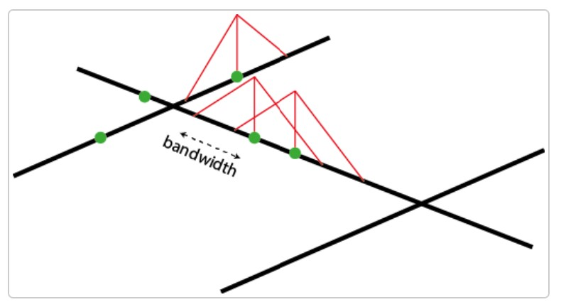
:::
:::::

------------------------------------------------------------------------

### NKDE Method

::::: columns
::: {.column width="50%"}
With this method, one can evaluate the density of the studied phenomenon at each location on the network. In the figure below, 3 sampling points (s1, s2 and s3) are added in blue.

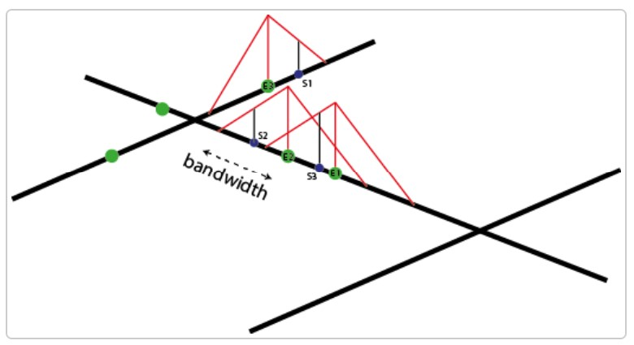
:::

::: {.column width="50%"}
Where S1, S2, and S3 are calculated by using the formulas below:

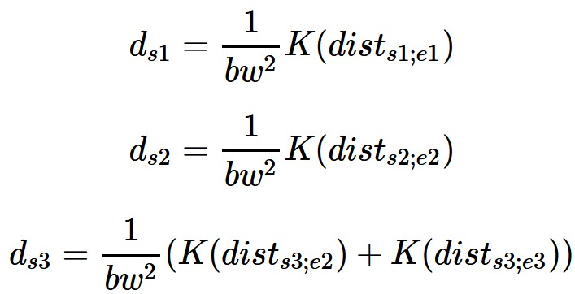{width="640"}

and the general formular will be defined as:

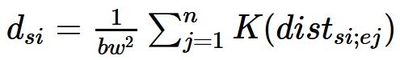{fig-align="center" width="450"}

with 𝒅~𝑠𝑖~ the density estimated at the sample point 𝑠𝒊, 𝒃𝑤 the bandwidth and 𝑒𝑗 an event.
:::
:::::

------------------------------------------------------------------------

### NKDE Method

::::: columns
::: {.column width="50%"}
The proposed kernel functions in the spNetwork package are:

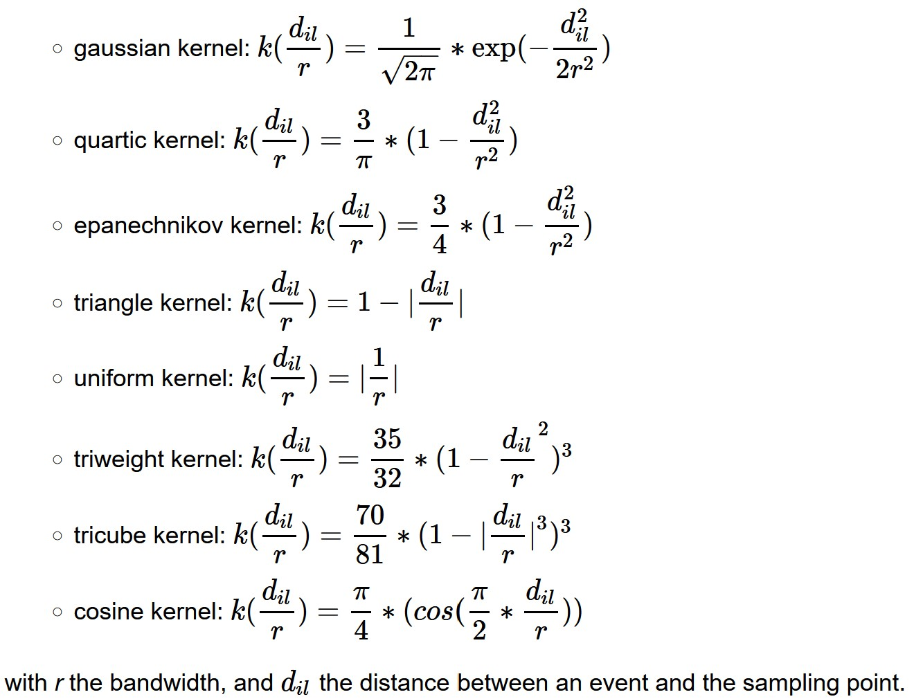
:::

::: {.column width="50%"}
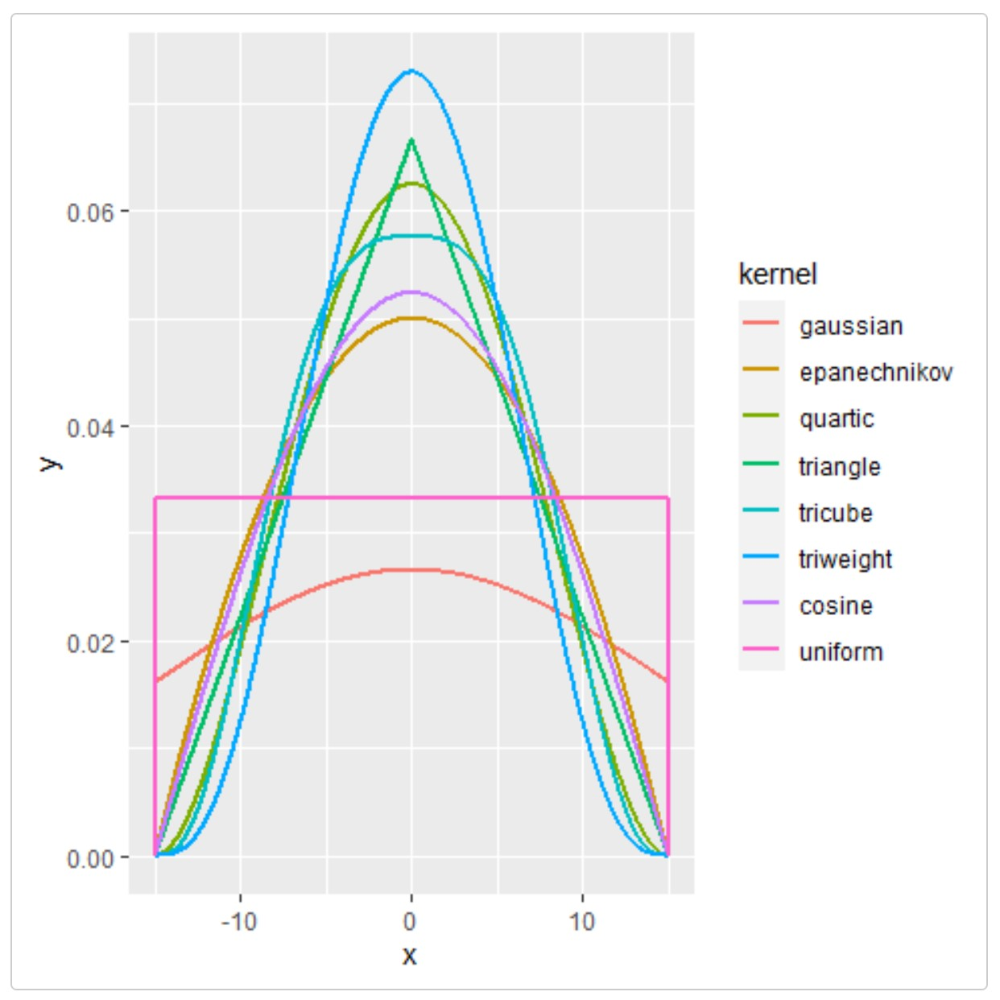
:::
:::::

## The Three version of NKDE

### Simple method

:::::: columns
::: {.column width="50%"}
The first method was proposed by Xie and Yan (2008). Considering the planar KDE, they defined the NKDE with the following formula:

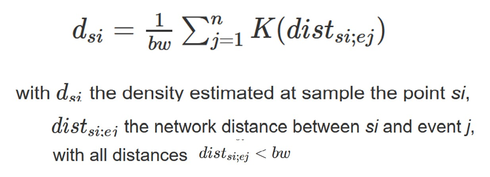

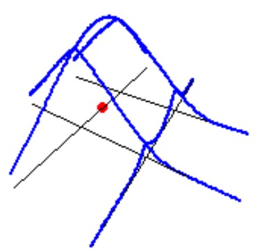{fig-align="center" width="300"}
:::

:::: {.column width="50%"}
::: callout-note
This method remains useful for two reasons:

- For quick data visualization. With big datasets, it might be useful to use this simple method to do a primary investigation.

- In a purely geographical view, this method is intuitive. In the case of crime analysis for example, one could argue that the strength of an event should not be affected by intersections on the network. In that case, the kernel function is seen as a distance decaying function.
:::
::::
::::::

## The Three version of NKDE

### Discontinuous method

:::::: columns
::: {.column width="50%"}
This method is introduced by Okabe and Sugihara (2012). The discontinuous NKDE is easily presented by a figure:

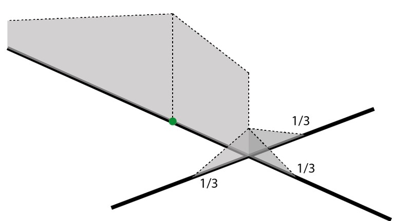 Note that the density of the kernel function is equally divided at intersections.
:::

:::: {.column width="50%"}
::: callout-warning
As one can see, the values of the NKDE are split at intersections to avoid the multiplication of the mass observed in the simple version. However, this creates a discontinuous NKDE, which is counter-intuitive. It leads to sharp differences between density values in the network, and could be problematic in networks with many intersections.
:::
::::
::::::

## The Three version of NKDE

### Continue method

:::::: columns
::: {.column width="50%"}
The method merges the best of the two worlds: it adjusts the values of the NKDE at intersections to ensure that it integrates to 1 on its domain, and applies a backward correction to force the density values to be continuous.

This process is accomplished by a recursive function. This function is more time consuming, so it might be necessary to stop it when the recursion is too deep. Considering that the kernel density is divided at each intersection, stopping the function at deep level 16 should give results almost identical to the true values.
:::

:::: {.column width="50%"}
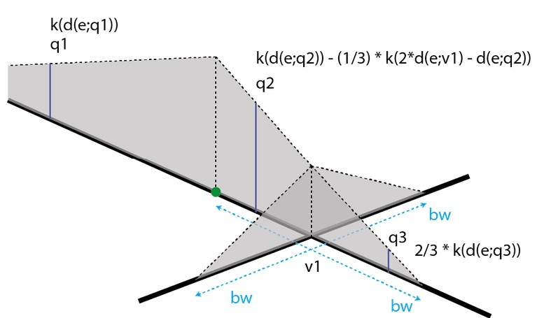

Note that there are three different equations to calculate the kernel density depending on the situation (here, q1, q2, q3).

::: callout-note
As one can see, the values of the NKDE are continuous, and the density values close to the events have been adjusted. This leads to smoother results than the discontinuous method.
:::
::::
::::::

## Temporal Network Kernel Density Estimate

::::: columns
::: {.column width="50%"}
Events recorded on a network often have a temporal dimension. In that context, one could estimate the density of events in both time and network spaces.

The spatio-temporal kernel is calculated as the product of the network kernel density and the time kernel density.
:::

::: {.column width="50%"}
For a sample point at location l and time t, the Temporal Network Kernel Density Estimate (TNKDE) is calculated as follows:

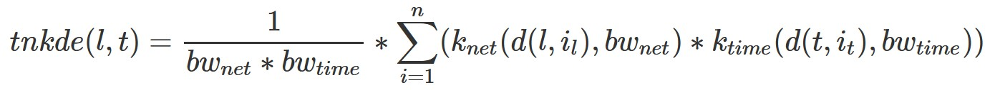

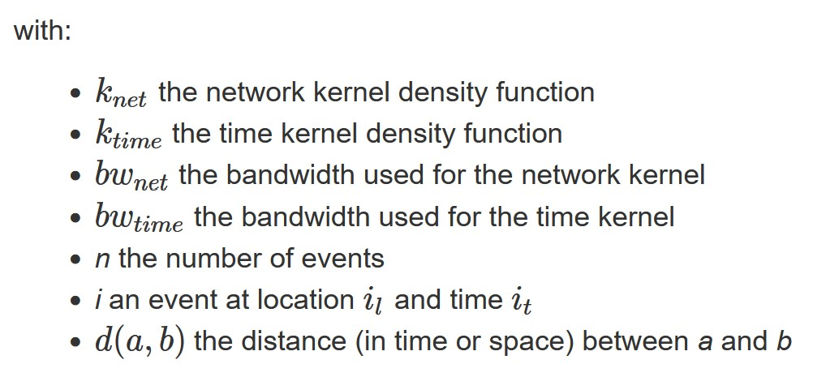
:::
:::::

## References

- [Network Kernel Density Estimate](https://jeremygelb.github.io/spNetwork/articles/NKDE.html)

- [Temporal Network Kernel Density Estimate](https://jeremygelb.github.io/spNetwork/articles/TNKDE.html)