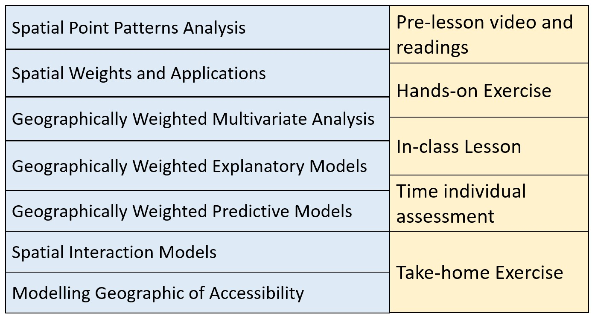

# Synopsis

Where should the next new business outlet be located in order to optimise the profit? What are the location factors that affect the resale prices of HDB housing units? Which are the economic or service activities such as IT professional firms, car workshops, fast food chains (ie. KFC, McDonalds), coffee outlets (Starbucks, Ya Kun Kaya Toast, Toast Box) that tend to be located close to one another and which are the ones that tend to be a distance apart? Do these observed patterns and processes occur at random or are they being constrained by geographical factors? These and many other related questions are the challenges faced by data scientists and data analysts today especially when geographical data are used.

Geospatial Analytics offers the solutions to these questions by providing data scientists and analysts a problem-driven and data-centric analysis framework focusing on discovering actionable understanding from geographically referenced data. It makes extensive use of geospatial data wrangling, geoprocessing, spatial statistical, geospatial machine learning and spatial data visualisation techniques to support decision- and strategy-making.

This course provides students with an introduction to the concepts, principles and methods of geospatial analytics and their practical applications of geospatial analytics in real world operations. Emphasis will be placed on:

-   performing geospatial data science tasks such as importing, tidying, manipulating, transforming, projecting and processing geospatial data programmatically,

-   visualising, analysing and describing geographical patterns and processes using appropriate geovisualisation and thematic mapping techniques,

-   conducting geospatial analysis by using appropriate spatial statistics and Geomachine learning methods and

-   communicating the geospatial analysis pipeline in a reproducible report.

# Objectives

Upon completion of the course, students will be able to:

-   Provide accurate explanation of the Mathematical and input data requirements of the analysis method(s) used,
-   Import, extract, process, transform and assemble geospatial analytical sandbox programmatically,
-   Apply appropriate geospatial analysis methods in addressing specific analysis needs,
-   Document the entire geospatial analytics process in a reproducible manner, and
-   Communicate the analysis results effectively and in an easy to understand manner with the help of appropriate geo- and data visualisation techniques.

## Course structure

### Basic Modules

This course comprises ten integrated components as shown below:

## Grading Summary

| Assignments / Assessment categories                   | Weighting |
|-------------------------------------------------------|-----------|
| Pre-lesson Learning and Hands-on Exercise (2.5% x 10) | 25%       |
| Class participation and In-class Exercise (1.0% x 10) | 10%       |
| Timed Individual Assessment                           | 20%       |
| Take-home Exercise (Not more than 3)                  | 45%       |

### Pre-lesson Learning (5%)

Pre-lesson videos and recommended readings exercises will be released one week before the weekly lesson starts. A strict requirement for each class meeting is to complete the assigned readings and video before coming to class. Students are required write down at least one question or issue encountered while viewing the video or reading the recommended articles and post them on Piazza for discussion.

Student sharing of insights from readings of assigned materials on Piazza will form a large part of the learning in this course.

### Hands-on Exercise (20%)

Hands-on exercises aim to provide students to gain hands-on experience on using R and R packages to perform geospatial analysis with real world use cases. It is important for students to complete the hands-on exercises before class.

### Class Participation and In-class Exercise (10%)

In-class exercise and discussion will extend the methods learned from the hands-on exercise to advanced modelling. The in-class discussion will also focus on how to interpret the analysis results and to communicate the analysis results by using appropriate map and data visualisation techniques. Students may also be quizzed in class and thereby contribute to in-class exercise.

### Timed Individual Assessment (20%)

A timed individual assessment is designed to evaluate each student's ability to complete an assignment within a specified time limit. The assessment will involve, but is not limited to, understanding the business problem, assembling the analytical sandbox, performing the analysis, and interpreting and communicating the results. It will be conducted in class and will not exceed 30 minutes.

### Take-home Exercise (45%)

There are three take-home exercises that are due throughout the term. They aim to provide students the opportunities to apply the methods learned in class by working through mini real-world cases. Each take-home exercise is an extension of the hands-on and in-class exercises. What this means is that, for example, in Lesson 2, students will learn the concept of spatial point processes and the hands-on exercise will provide students step-by-step guide on how to use R and R packages to perform spatial point patterns analysis. The in-class discussion, beside clarification of the concepts and usage of R packages syntax and argument, it will focus more on how to interpret and communicate the analysis results. Then the take-home exercise will require students to synthesise what they have learned from the readings, hands-on exercise and in-class exercise. The estimated workload will be about 6-8 hours per week.

Each take-home exercise will carry a same weightage of 15%. The deliverable format of the take-home exercises and marking rubric of will be provided on the handout of the take-home exercise. Feedback on take-home exercise will be provided weekly before the weekly lesson starts. This is to ensure that students will learn from mistakes made in the earlier take-home exercise and improve their work progressively in the subsequent take-home exercises.

Students may work together to help one another with computer or geospatial issues and discuss the materials that constitute the take-home exercise. However, each student is required to prepare and submit the take-home exercise (including any computer work) on their own. Cheating is strictly prohibited. Cheating includes but not limited to: plagiarism and submission of work that is not the student’s.

### Final Exam

There will be no final examination for this course.

## Reference

-   Gimond, Manuel. (2018) [Introduction to GIS and Spatial Analysis](https://mgimond.github.io/Spatial/).
-   Floch, J.M., Marcon, E. and Puech, F. (2018) [Handbook of Spatial Analysis: Theory and Application with R](https://www.insee.fr/en/information/3635545).
-   Edzer Pebesma & Roger Bivand (2025) [Spatial Data Science with Applications in R](https://r-spatial.org/book/).
-   Robin Lovelace, Jakub Nowosad & Jannes Muenchow (2024) [Geocomputation with R](https://r.geocompx.org/index.html).
-   Moraga, Paula. (2023). [Spatial Statistics for Data Science: Theory and Practice with R](https://www.paulamoraga.com/book-spatial/index.html). Chapman & Hall/CRC Data Science Series. ISBN 9781032633510
